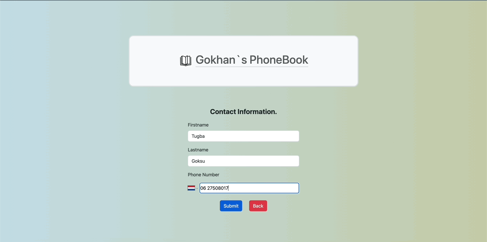

<h1>React PhoneBook App</h1>

An React PhoneBook app which is designed & created by my self.

<h2>Techniques used for this project</h2>

Used React Router Dom for using separate pages, builded Re-usable Header component, and other components. Used the CRUD as base. fetched,created and updated db.json via axios. Used some bootstrap and own style for the stlying of the page. 

<h2> Screen gif of final result</h2>

